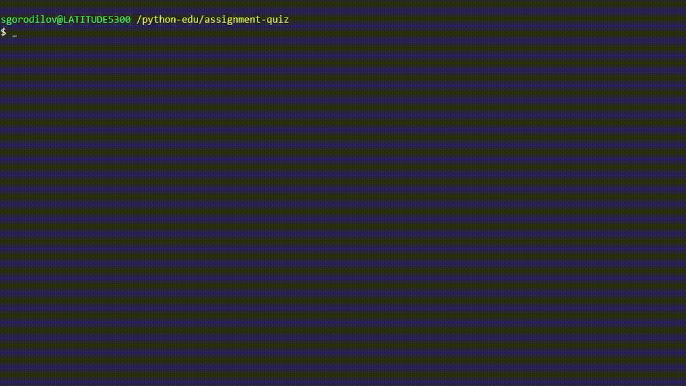

# Instructions

This project provides a simple command line script to ask the user questions
from the file. The question file uses the pre-defined structure. After all
answers are gathered, the total score is displayed to the user and the script
execution is completed.



## Objective

Your task is to implement a script to run a command line based quiz.
The users will enter their names and answer questions from the file
one-by-one. At the end of the quiz the score should be displayed to
the user, and a record should be created inside the *scores.txt* file.

## Requirements

### Gather username

This function prompts the user to input their name. The name should meet
the requirements:

- non-empty string
- no longer than 10 characters

In case the requirements are not met - ask again until the inputs passed
the test.

The function will return a name entered by the user.

### Load questions from a CSV file

Questions are stored in a CSV file, that follows the pattern:

```text
Question text?,"option 1,option 2,...,option n",correct answer
```

This means, first column contains a questions;
the second one stores all options available for answer;
the last one stores the correct answer.

The correct answer comes in a form it was written in the options' column.

Double quotes are used to store text with commas as a single column value.

The data structures aliases are defined as:

```python
from typing import List, TypedDict

Question = TypedDict("Question", {
    "question": str,
    "options": List[str],
    "answer": str,
})
Questions = List[Question]
```

The output structure for the question is a Python dictionary with keys:

- question
- options
- answer

The function should return a list of question dictionaries.

### Display questions

This function simply prints out the question data to the user.
The question text always has an empty line before and after it.

```text

Is this a question?

```

And each option should be printed out on a separate line with an option number
prepending it. The option numbering starts from 1.

```text
1   option 1
2   option 2
3   option 3
```

The option number and the option text are to separated using whitespace symbols
of any type; at least one separator symbol required.

All together, the question structure:

```python
question = {
    "question": "Is this a question?",
    "options": ["Yes", "No"],
    "answer": "Yes",
}
```

will be printed out like:

```text

Is this a question?

1   Yes
2   No
```

### Gathering answers from the user

The users will be prompted to enter their answer after the question is printed
out. The prompt should container text `"Submit answer: "`.

The function should return **the actual index** of the selected option.
E.g. for the options `["A", "B", "C", "D"]` printed as:

```text
1   D
2   B
3   C
4   A
```

If the user choice is `4` (option `"A"`), the function should return `0`,
as the actual index of `"A"` in the options list.

### Test if the answer is correct

The function gets question dictionary and the user answer as its arguments.
It returns `True` in case the answer is correct, otherwise `False`.

### Perform quiz

This function gets a list of questions as its argument.
It displays questions one by one, and tests the user answers for correctness.

The return value is the quiz's score - the number of correct answers.

### Write score to a file storage

The function gets username and quiz score as its arguments, and writes them
to the file named **scores.txt**.

The scores file structure is defined as:

```text
username    score points
```

There are two columns, separated by two white space character.
The first column width is fixed to 10 character.

So, the content of scores file may look like:

```text
username_1  10
user        5
quiz a      3
foo         20
bar         4
foobar      15
```

### Combine all functions together

The `main` function (not the **main.py** module) is the quiz core.
It combines all the functionality together and performs the quiz.

At the end the quiz results are to be writen to the **scores** file,
and the user should get the message:

```text

Quiz score: {score}

```
